# Best of techsupport


{: .no_toc }

This is a collection of some of the most hilarious (and dumbest) interactions I have had when volunteering at the r/techsupport discord server. I have been volunteering there for a few years now (climbing the ranks to admin now), and trust me when I say that I have seen some truly ridiculous things.

The discord server also contains some incredible people, many of whom have mentored me and helped me grow as a tech support volunteer. I have learned a lot from them, and I am eternally grateful for their guidance and support. However, this blog post is not about them. This is rather about the people who made me tempted to punch my screen in sheer frustration and disappointment. Here is a list, enjoy!

### Squeaky clean!

### "Oh the files on the USB are important?"
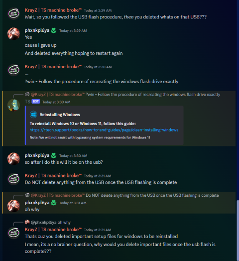

### Partitioning hell
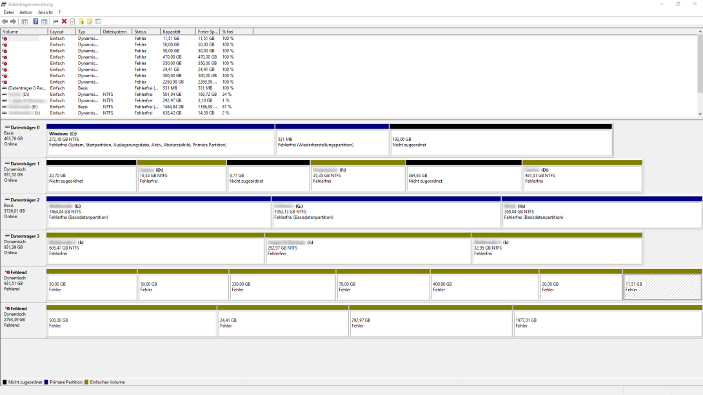

### Godzilla had a stroke...
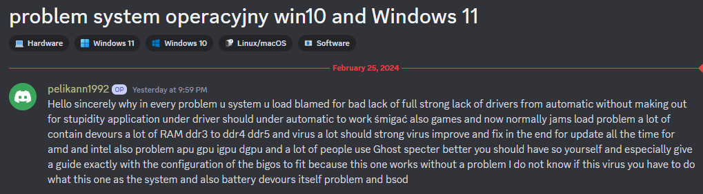

### "Why isn't my drive showing up?"
And they just bought the drive too.
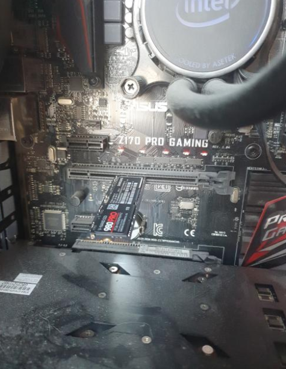

### "How many times have you reinstalled Windows?"
The answer apparently was "Yes".
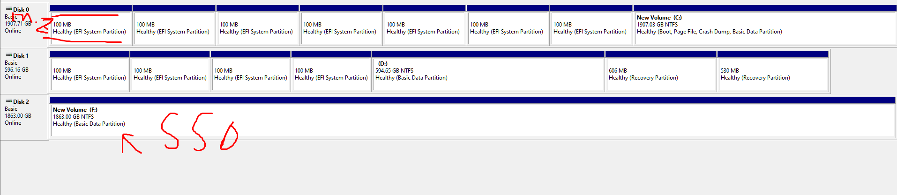

### Source: Trust me bro
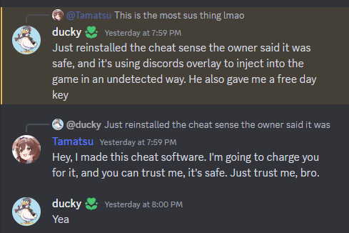

### First time I saw a boneless mouse
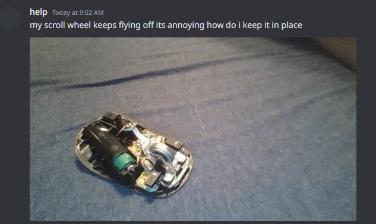

### I wonder why the HDD says "Do not open..."
"Whatever I am sure it wasn't important!"
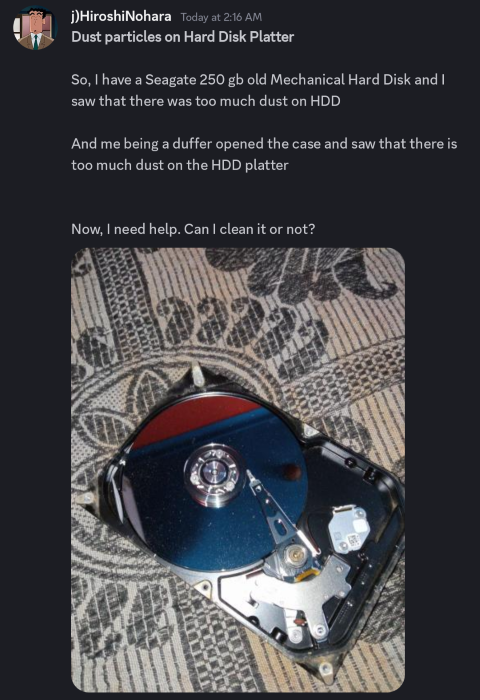

### Computer literacy really is going down the drain huh...
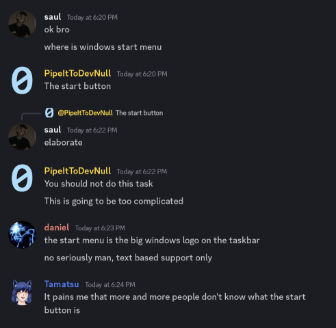

### When I mean PING, I don't mean the discord kind

### I have questions...
And I do not know if I want any of them answered...
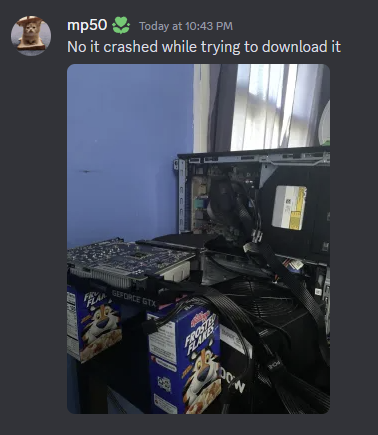

### Outsourcing thinking to ChatGPT now
Using two brain cells is hard apparently in the modern day...
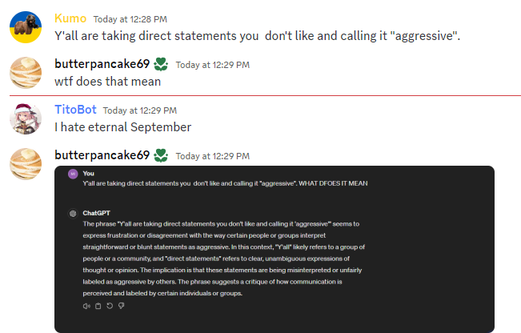

### You know what, I didn't want to know...
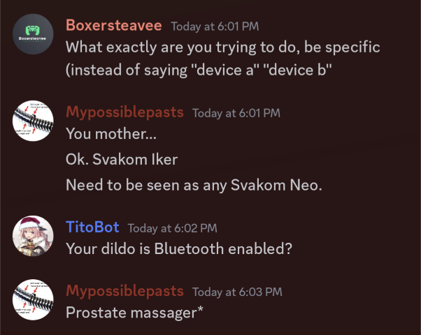

### Reading is hard apparently...

### New revelation: Fans apparently spin
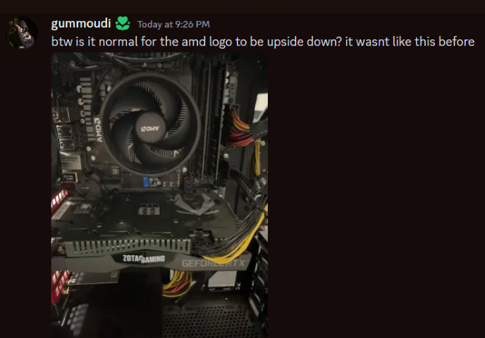

### Solder fail
Soldering is a skill. If you lack it, don't do it!
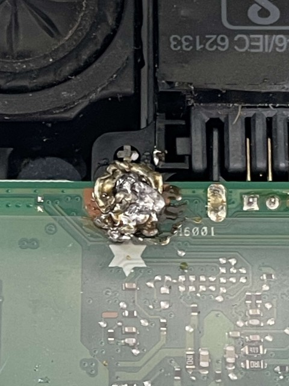
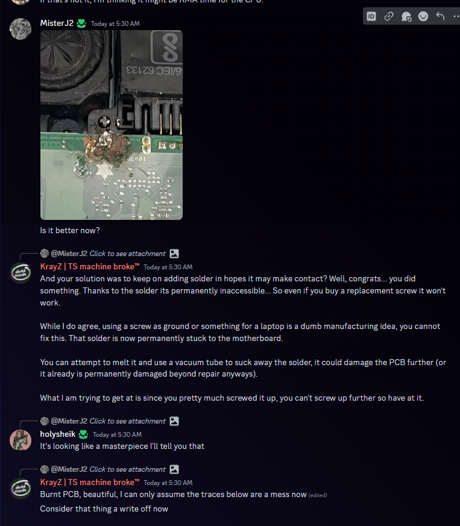

### Running water + electronics
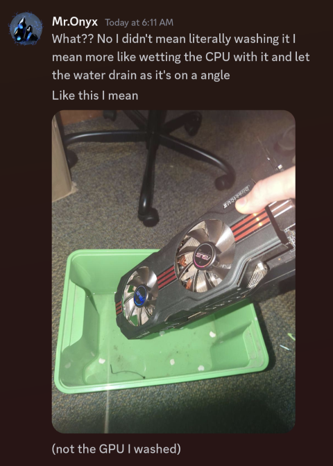

### Tik-Tok kid finds out what a CPU is
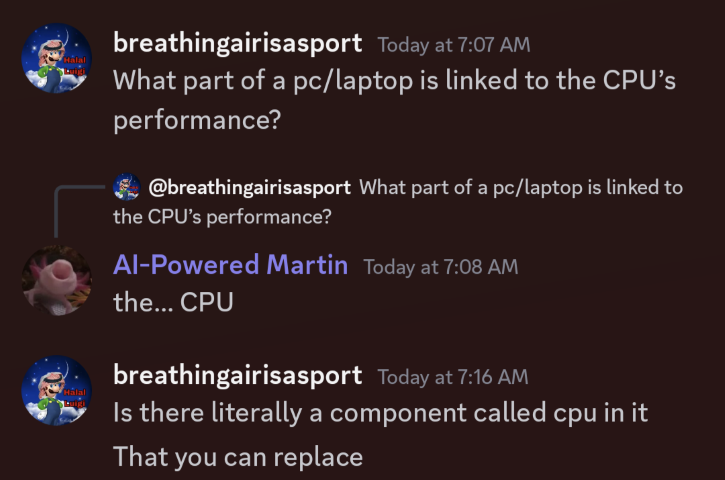

### Another day, another opened PSU... charger?
Some people need to get shocked to hell to realize consequences of wall power...
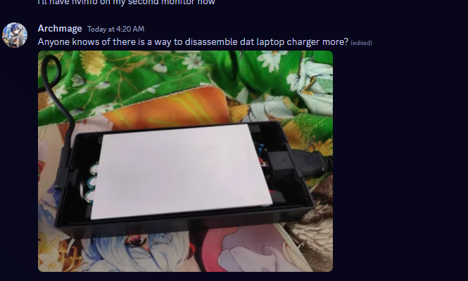
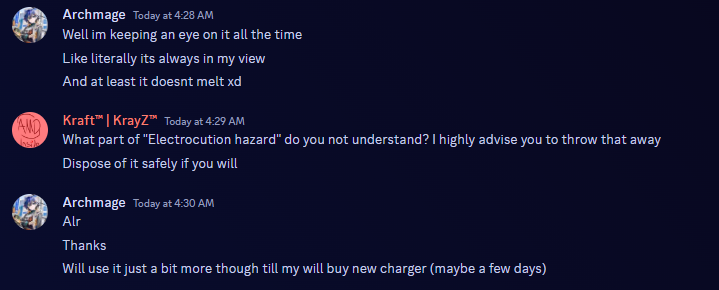

### Tier G PSU
*And they still continued to use it!*

### Sometimes the issues are actually simple
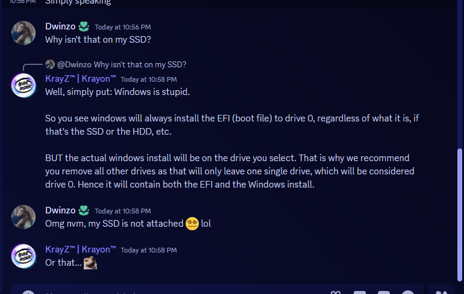

### What a twist
So it turns out you in fact needed those items...
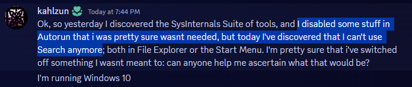

### "Please dumb it down for me"

### More detail please!
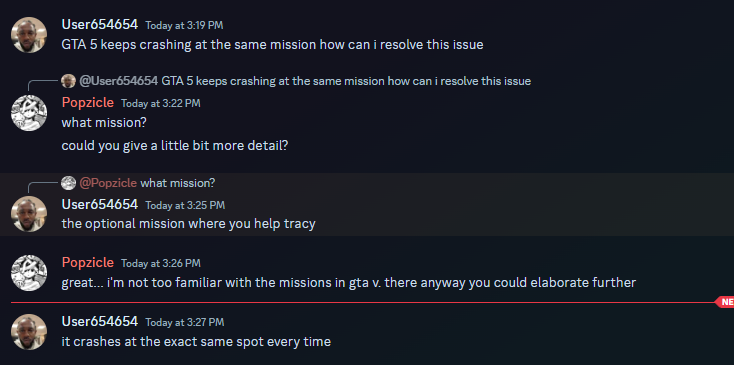

### Hero to zero

### "Cybersec expert"

### At least they used zip ties...
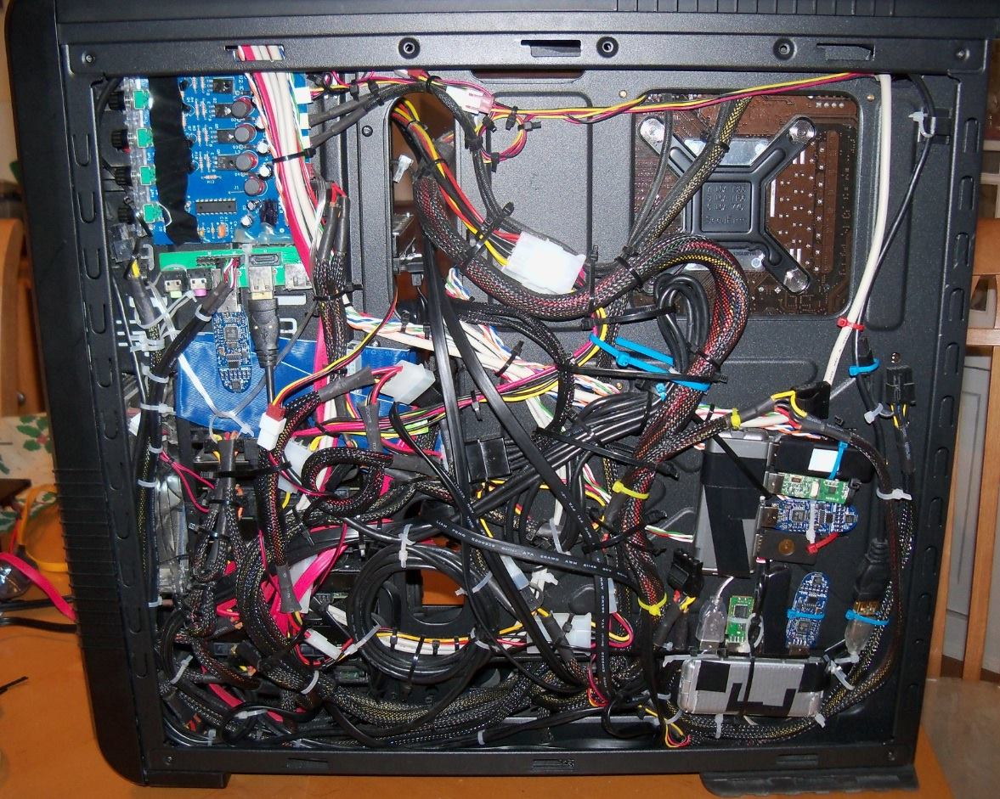

### You did what to the capacitor?
The user also cracked the cold plate of the cooler too, but I think that's the least of the dude's issues... Yes they were using a power drill.
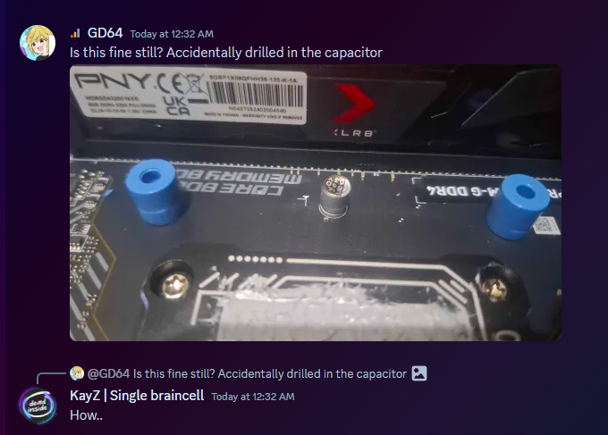

### Powerline adaptors as a switch
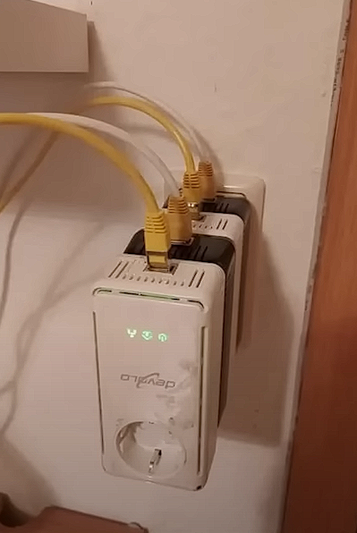

### Tier G PSU part 2

### Help! The latch does not close!
It was a 7950X3D too...
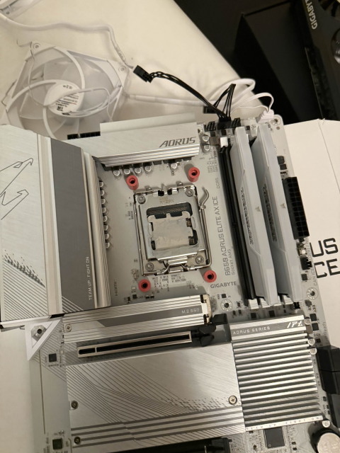

### I need a 4090 to get better FPS!
*He says on a 75 Hz display...*
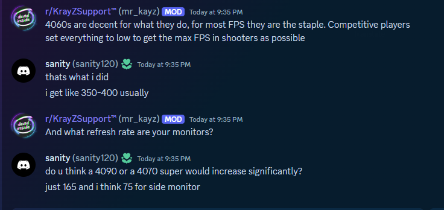