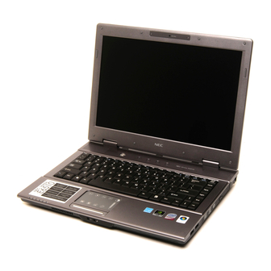
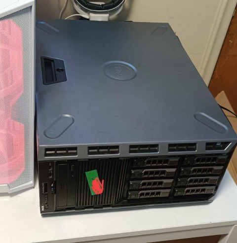
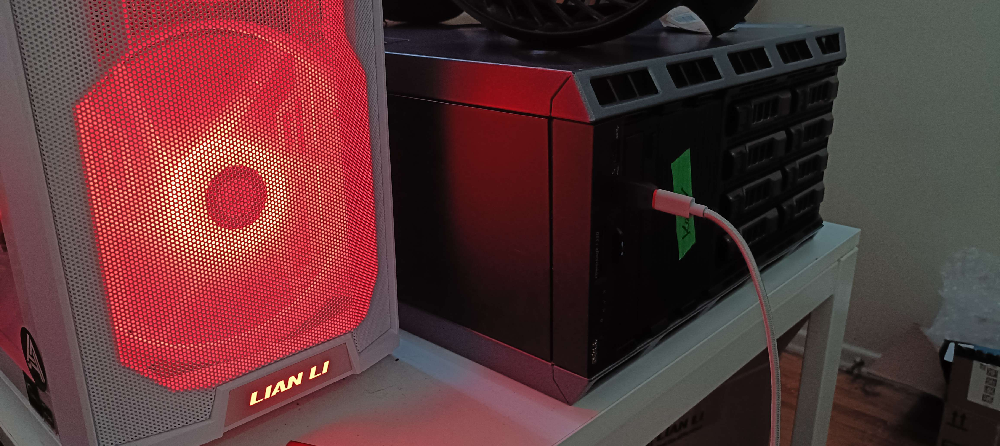
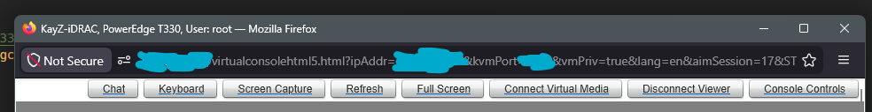
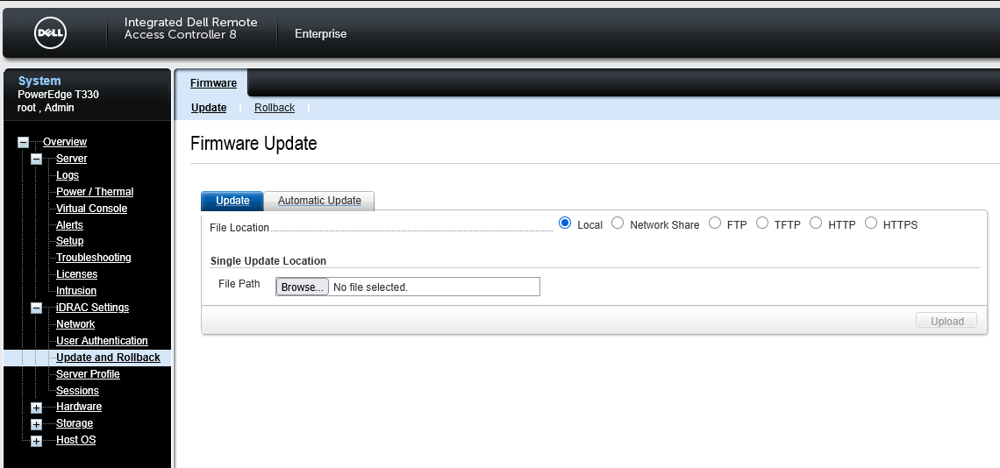

# In the beginning

This is just a quick story of my life so far and how I ended up with my T330.

{: .no_toc }



## My background

When growing up, my father made sure to not spoil me rotten, which I do deeply appreciate him for. But this meant I never really had any consoles or anything back then. My childhood was playing flash games on y8.com on the family computer that was given to us by my father's university (he was currently working as a post-doc) back from 2002 to 2006 or so. God those were the days, weren't they? Big massive CRT monitor, a computer running Windows XP, Internet Explorer being trash as ever so we all used Firefox. Good times indeed.

Back then I was too young to even know the internal hardware or what hardware was to begin with, naturally as a primary school student. All I did understand was that the big tower was the computer, and the monitor connected to said computer to show images on screen. Now I don't remember what exactly fascinated me about it, but I think it was like magic to me at the time which got me so invested in technology in the first place. My father commented that I can never take my eyes off the monitor ever, because I was so interested in how they all worked, like "What makes you tick?" sorta attitude. I guess it was pretty much set in stone that I will be an electrical engineer since the very beginning from that point on.

Growing up, my father got me (well it was for him really but I used it most of the time) our first ever laptop in 2007: a NEC Versa E6500. That came with Windows vista, and to me, I was shocked to see such a tool. Like it was just like the big computer, but... it was an all in one! It had a flat monitor! It can run games, and it ran of battery? What magic allowed this thing to work? And so I spent the next 4 years with it playing more flash games, watching youtube, browsing the web, and so on.

<figure>
    
    <figcaption>The NEC Versa E6500 in all it's glory, what a little beast you were...</figcaption>
</figure>

### Middle school days

Moving into 2012 I entered middle school, we changed countries so we left the university provided computer, and my father (who became a professor) got a hand-me-down desktop from another professor who was leaving for other endeavors, and that finally became fully mine. In addition, my father got himself a more upgraded laptop to do his CAD work, so now I fully owned two devices: A laptop and a desktop at age 12. Fast forward 2 years with me messing around with my computer, and a sudden thought came into me.

Now, my desktop PC at the time was really bottom of the barrel but worked for its purposes:
- Intel Core Pentium IV (what class I am not too sure)
- NVidia GeForce 210
- 8 GB DDR3
- 250 GB HDD running Windows 7

Still, despite its age being equivalent to the NEC Versa, it still was more powerful as it had a dedicated GPU and proper CPU. So I thought to myself: "How can I combine the two of these to make a more powerful computer?"

Now 14 year old KayZ was only book-smart. My tech experience only went as far as the classic ICT lessons in school, so I know that you can connect two computers together. But those were all theoretical discussions, not practical. So I researched a bit and found out that I needed some ethernet cable to connect two computers together. Well good thing the ISP at the time gave us a few extra cables, so I grabbed one and went to do my first ever "homelab" project. Main goal? Getting Minecraft to work.

Now I mainly ran Minecraft on the laptop, but the issue with that is the laptop is 7 years old by now, and the Intel Dual Core CPU in it was really starting to show its age at the time - running a server at the same time as running the game became a full workout for the laptop. But my desktop existed, and it can do things well too. So why not use the processing capabilities instead of that? And so began my first ever journey into "homelabbing".

Well its more appropriate to say first half-attempt at a full homelab: I didn't know Linux at the time and seeing all the install texts back then was daunting so I stayed away from that and just got it running on Windows, which was successful. I made a classic vanilla server and let my friends play with me on Minecraft and that was as far as I got.

But the thought never left me: **I can repurpose another computer to run stuff so I can use my main device to connect to it. In other words, I now know the concept behind having a personal server.**

### Growing up and evolving

Fast forward to 2023, I was basically in my third year of my Electrical Engineering degree, taking on an internship year when I used that sweet internship money to land me a neat high end gaming PC which I always wanted as a kid. But since I was in uni and living alone, running my PC all the time for everything would mean it would be a massive strain on the electricity bill (high end parts = equivalent energy costs). That and the fact that I recognized that my uni life would end soon, meaning my OneDrive access and all projects I have made over the years during my time at uni and all will no longer be accessible.

No, what I needed was an external storage medium. And I ain't a fan of paying subscription fees either to some third party - I want to own my own stuff with my own equipment. What I needed... was a NAS.

## Getting a dedicated server

{: .info }
> **Network Attached Storage (NAS)**
>
> A NAS is a dedicated centralized file storage device that is connected to the local home or business network so multiple users and devices can access this to store and retrieve data from a single location. It effectively is a private cloud of sorts.

Initially I didn't think much more of the thought of having my own NAS, just thought simply having one was a good idea. So I searched up "best NAS" on Google, and found myself multiple small boxes of Synology drives, which is highly recommended for quick setups and easy-to-use interface. I thought "Neat this will work!", and then I saw the price.

At the time the Synology DiskStation DS925 costed $700 CAD. That... was just the price of the box, not even disks or anything. That was one of the cheaper options for a 4 bay NAS. Now sure I can spend that much easily, but surely I can spend it much more reasonably. So then I thought about going maybe refurbished, and then a few workstations caught my eye while I was browsing Ebay. And then I had a thought: Older refurbished workstations or equivalent, and then load my own NAS OS in there!

Now the reason I went with this thought is that I know how enterprise equipment worked at the time (I mean I work with one myself for my internship). A lot of these are extremely power efficient because electricity is expensive for everyone, even companies, so if I were to get a workstation with lots of drive bays, then that can solve my NAS problem. In addition, a lot of companies sell their hardware when they upgrade to new equipment, so getting a refurbished enterprise workstation should be relatively cheap, even if a bit old. And the best part is that these are also designed to run different OS's to suit enterprise needs, and driver support for all kinds of OS. So running a dedicated NAS OS on it would be easy too.

Browsing for the next day or so with continuous research, I finally came across Delta Server Store, which apparently was a server recycling and refurbishing center for all kinds of hardware, with prices being extremely reasonable ($300 CAD at the time). Perusing around a bit more, and I came to my ideal server: The Dell PowerEdge T330. 

It had everything I needed and more that I didn't even know I wanted to have:
- 8 drive bays compared to 4
- Gigabit ethernet connection
- Even dual redundant power supply (Intel CRPS) so it never goes down
- Management chip (iDRAC 8 Enterprise) for remoting in
- 32 GB DDR4 ECC RAM (default)
- Intel Xeon E3 1270 V5 CPU (very power efficient CPU)

All in all, these are the makings of an extremely power efficient system for running my NAS. I asked around Reddit and a few discord servers and all of them said the Dell T330 is one of the best starting homelab setups out there due to its wide variety of support for all kinds of OS, drive passthrough, server upgrade capabilities, etc. - I was convinced by now. This will be my NAS.

Putting in an order for 4 WD Red Pro NAS HDDs, one AData 250 GB SATA SSD (to use as a boot drive) as well as the server itself, the total cost of my NAS came out to roughly 800 CAD for a 16 TB NAS system, which honestly is one of the best purchases price wise I have done so far.

<figure>
    
    <figcaption>What a chonker of the machine this is, the T330</figcaption>
</figure>

### Learning about the T330

So now I have 4 drives, I have my server. Now I need to choose the proper OS to properly set it up as a shareable device on the network so it can state to all devices that the folders are there and can be used for file storage. But before that, lets test the capabilities of my system.

Since it was a Dell, my first thought was getting experience with the management hardware since it came with one: The Dell iDRAC.

The Integrated Dell Remote Access Controller (iDRAC) is a device within enterprise servers (such as the T330) that allows a user to locally manage the server remotely. It has the ability to deploy, update and monitor all sorts of servers from Dell. In short, its basically a [KVM switch](https://en.wikipedia.org/wiki/KVM_switch) on steroids with far more control and capabilities, all readily built into the server.

For the T330, you can connect to the iDRAC in two ways:
- Connect directly to the ethernet port of the iDRAC module on the back of the server
- Connect to the USB port of the front of the case for iDRAC Direct

Now I can connect to the back of the case, but the problem was the server configurations and management were all wiped, including the static IPs set to allow a user to connect to iDRAC via ethernet. Normally this should automatically default it to `192.168.0.120`, but for some reason it wasn't working. So that meant I had to go through iDRAC direct from the front which had a permanent static IP of `169.254.0.4`.

Issue was, it has a USB A port on the front. And I did not have any USB A to A cables lying around, nor are they common. Solution? USB A to C cable, and then a USB C to A adaptor. It looked and felt wrong connecting two computers using a double ended USB A cable, but typing that into my web browser, it worked perfectly. I was greeted with the login screen for iDRAC (which powers on when you connect the power supplies to power automatically - no need to turn it on separately).

<figure>
    
    <figcaption>If it works, it ain't stupid</figcaption>
</figure>

{: .note }
> **iDRAC default login**
>
> The default username and password for these legacy iDRAC devices is User: `root` and password: `calvin`. 
>
> More modern systems however may ship with a unique factory-generated password that is located on the Service Tag label on the front of the server chassis.

Inputting in the password, I was greeted with the usual default screen with so many different options to choose from, including the most important part: The virtual console. The virtual console is the built in KVM switch I was talking about earlier, and allowed me to not only see the output of the device's screen without having a monitor plugged in (good thing too, as none of my monitors supported VGA and the T330 only had that as the default display out) but also had keyboard and mouse passthrough, as well as a virtual CD drive that allows me to put in any ISO (OS image) of my choice and boot it up (a feature most commercial KVM switches usually lack).

<figure>
    
    <figcaption>Virtual Console in iDRAC</figcaption>
</figure>

Before going too far, I decided that the best procedure is usually updating everything to ensure that everything is safe and secure. In the details tab I could easily see that my BIOS version and iDRAC version were both out of date (firmware from 2018 and 2019 respectively) so its time to update them with the latest versions. Thankfully, the iDRAC could also manage this easily too, as it had an "Update and Rollback" feature built in too (under the iDRAC Settings tab in the left sidebar). Here you can browse local files on your main machine and then upload it to the iDRAC for it to apply the updates manually. The update files and downloads can be found [here](https://www.dell.com/support/product-details/en-ca/product/poweredge-t330/drivers).

<figure>
    
    <figcaption>Firmware Update Page in iDRAC</figcaption>
</figure>

It was here where I found out something interesting. The files you add here must be in the form of `.exe` files, Windows executable files, as trying all other file formats failed to work, even the "BIOS" format. In other words, from the support page of the T330, you must select Windows Server (any version, but ideally 2019 and above works the best) when downloading the firmware. This could mean that the iDRAC itself is possibly running some form of heavily customized Windows IOT, but I can't find any more sources beyond "embedded RTOS". However upon doing more research, I believe this to be false and the more likely scenario is that its running something proprietary (obviously), and Dell ships firmware updates as Windows Executable DUP (Dell Update Package) files, and iDRAC simply has a built-in handler that extracts the actual firmware payload inside those `.exe` files.

With both BIOS and iDRAC firmware updated, its time to set up my network properly. Now unfortunately my ISP provider only has an extremely rudimentary DHCP server built into the router and there is no way to set ranges nor do anything more than to reserve slots, unless I pay for a business plan which as a student at the time, yeah I don't have the cash to pay for enterprise networking. So static IP it is. These can be found in the "Network" tab underneath iDRAC settings.

{: .note }
> **iDRAC Network settings**
>
> This page only sets the network settings of the iDRAC only! To set up the OS IP, you must do so within the OS itself.

iDRAC static IP set, now time to connect to it directly using the dedicated RJ45 port without relying on the iDRAC direct port via USB. Typing in the IP in my web browser, voila, I was in again. So far everything was working smoothly as planned.

### The OS choice - Round 1

Now I had been tinkering around with Proxmox for a while before I even got this dedicated server. In fact, I decided to use my original laptop that my father got for me for university as a Proxmox host so I can run virtual machines of all kinds from a web interface easily, without having the consequences of running something like Oracle virtualbox having the default OS overhead since it was running on a Windows machine, and the fact that its a type 2 hypervisor did not help matters. Even with a type 1 hypervisor like Hyper-V, there still remains host OS overhead taking up loads of resources and tanking overall performance of the virtual machine.

{: .info }
> **Different types of Hypervisors**
>
> A Hypervisor or Virtual Machine Monitor (VMM) is a software that creates and runs virtual machines (VMs) by allowing multiple operating systems to share a single hardware host.
>
> There are two types of hypervisors: Type 1 and Type 2. Type 1 hypervisors run directly on the host's hardware to control the hardware and manage guest operating systems, while Type 2 hypervisors run on a conventional operating system just as other computer programs do.
>
> Typically, this results in type 1 hypervisors having better performance than type 2 hypervisors as they do not have to go through the host OS to access hardware and resources.

But my main idea for the T330 since I saw all the drive bays is that it will be a full on NAS, so that's what I went with. Searching up different kinds of NAS OS, I found a few contenders: Unraid and TrueNAS. Now Unraid is a professional quick and easy OS that provides numerous features including serving as a NAS, with the downside being only 1 year free trial before having to pay for the service, whereas TrueNAS has a community edition that's open source and comes without licensing fees nor user limits. This was a no-brainer at the time: TrueNAS it was.

The setup was relatively easy and simple, and setting up ACLs and samba shares to let my main Windows machine and other devices access the NAS was relatively straightforward too, and for 1 year that's what I lived with. But... that was boring. I noticed that my CPU barely is used at the time and I had more than enough RAM to spare. Sure as a NAS my main objective was pretty much done, but I wanted to do more with my homelab. So I thought maybe setting up Syncthing would curb that itch to do more, but the setup was so simple via the TrueNAS docker app I still wanted more. I never saw the CPU go beyond 5% utilization, even under full load and whatnot. And 90% of my RAM is just being used for the ZFS cache, with only 3% being utilized for OS and docker purposes. *Surely there's more I could do... right?*

I mean the whole point of a homelab, at least from my point of view is to set it up manually, to learn from what you have been doing so far, write notes and guides (exactly what I am doing right now) and tinker with it continuously. And nothing against TrueNAS at all, but it just working perfectly just wasn't interesting enough to me. (Don't get me wrong, TrueNAS working perfectly out of the box as advertised is the reason why everyone trusts it for a NAS OS. For a generic NAS, sure its perfect and I recommend it. But for homelab purposes, its very boring.)

This is also purely my opinion, but the best way one can learn is by tinkering with it, messing up, nuking everything, panicking and rebuilding everything from scratch; the process is what helps you learn, and failure is not just a step along the way, its understanding why you failed and what you need to do to make sure you don't fail again the important part.

### The OS choice - Round 2

I sat back down with my devices I have and thought about it more on what devices I had around me and what I could spare and mess with. Currently at my disposal I had:
- My T330 server
- My original uni laptop (Dell Vostro 7590) that I no longer use as a daily runner (I got a new Surface laptop instead for that)
- A raspberry Pi 4B
- My main Windows machine (Custom built PC)

And a few other Android devices, Steamdeck, Arduino MCUs, ESP32s, etc. But the ones I listed are the main ones I will be messing around with. Now all of these are connected to a simple network switch which then is connected to my router directly, so all of these can communicate with each other.

The core of my homelab will be my server obviously since its designed to run 24/7 without fail. Surely there is something more I can do with it, right? I then saw other people running different apps and items all on the same machine, so I had a thought: Why not run Proxmox on the machine directly?

Now before, my main thought was that Proxmox only was designed to run full scale VMs and whatnot, and surely would require a bit more power than what a measly Xeon E3 1270 V5 can provide, but then I realized that I can just run bare bones lightweight linux installs and containers instead and run different apps and services through those instead. And if I want to take it even further, I can make full-on LXC containers that are even more bare bones for maximum performance.

If that's not enough, I can also run bare bones debian CLI directly and manually run the services and apps I want too, but that will require me to run a full CLI and sure while I can do that, I got more experience with Proxmox and Proxmox comes with a web interface built in already so I won't have to set up my own. I nuked my TrueNAS install and installed Proxmox instead, and decided to set it up all again from scratch. And now, my server finally has more purpose in it.

#### Why Proxmox?

Now some of you may inquire: Doesn't TrueNAS have a VM service too? Why not use TrueNAS for setting up VMs?

Yes. Correct. TrueNAS does have a VM service and yes I can definitely use that too, but the service itself is quite meager and bare bones compared to a full dedicated hypervisor like Proxmox offers, including lack of LXC containers (and trust me, for some of my apps I do want access to those), no ballooning drives or RAM or more complex architecture setup. Proxmox has that and much more, and I can run a NAS OS as a VM and just pass through my drives directly for use; simply put, to get more out of a homelab, going Proxmox is the way forward.

Either that or a server OS like Ubuntu server or Debian core and then just manually set up services and stuff yourself.

Add to that my Dell Vostro can be used as the secondary proxmox node to run actual full operating systems for testing (mainly Windows) while also passing through my dGPU (GTX 1650) directly if needed to act as my main performance hypervisor, while my T330 runs services and apps and acts as a platform for self-hosting. Couple that with my Raspberry Pi running Tailscale to act as a VPN server to the rest of my network so I can access my stuff even if I am abroad, I am fully set now to continue my homelabbing adventures.