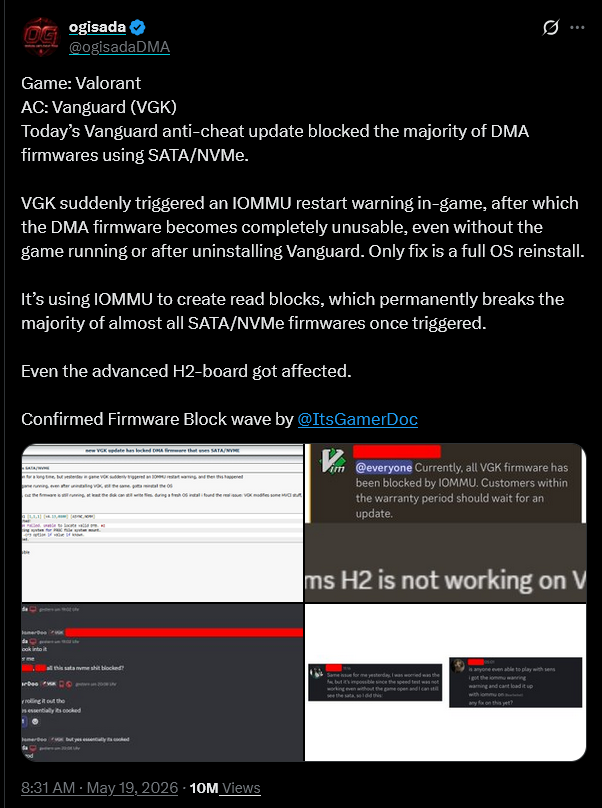

# Riot Vanguard - Extremely Intrusive Anti-Cheat Software

{: .no_toc }

## Riot Vanguard - An introduction
On April 7th, 2020, Riot Games announced the release of their new anti-cheat software, Riot Vanguard. This software does what any other anti-cheat does: detects cheats and hacks that's being used in their games, and take actions on cheaters and hackers accordingly. 2 months later on June 2nd, 2020, Valorant was announced which featured Riot Vanguard as the primary anti-cheat.

---

## What is an Anti-Cheat?
Before we dive into my critique of Riot Vanguard, I think its important to discuss what anti-cheats are and why they are becoming more invasive.

An anti-cheat is a software system that a game or developer utilizes to detect and block cheating in an online game. It scans for unfair programs like aimbots (which allow a user to "snap-on" to targets making aiming trivial), wall-hacks (which allows a user to see through cover or walls giving them an unfair advantage as they can tell where an enemy can be), speed-hacks (allows a user to move faster in games) and other cheats. For programs that don't have anti-cheat or trivial anti-cheats that can be bypassed, cheaters and hackers have a field day and can easily ruin the experience for everyone else who plays the game.

In the modern day, more and more anti-cheats are coming out being far more intrusive than previous generations, in order to combat more elaborate cheating methodologies and techniques. As a result, most if not all modern anti-cheats that provide significant protection against cheaters are kernel level anti-cheats (KAC for short). To explain what I mean by kernel level, this is where we have to talk about "privilege levels" for a PC operating system.

### Privilege Levels for an operating system
For any computer, be it phones, laptops or desktops, there are privilege levels which enforce access restrictions. The main reason they exist is to protect a system from bugs and malicious software by strictly limiting what different parts of a program can do and what access to what kinds of software and hardware a program has. 

These privilege levels are also referred to as Rings for x86 architecture from levels 0-3, with Ring 0 being the highest privilege level.
- **Ring 0 - Kernel mode**: This is the most privileged level, where the core operating system (aka the kernel) and essential device drivers run (like basic mouse and keyboard inputs for example). This zone has the highest access to all memory and hardware components, such as CPUs, and disk controllers.
- **Ring 3 - User mode**: This is the least privileged level, which most normal applications run at, such as web browsers and text editors. Ring 3 code cannot directly interact with the hardware (they are abstracted away) or access memory belonging to other processes here.

{: .info }
> **Rings 1 and 2**
>
> Rings 1 and 2 were historically meant for OS services and device drivers, but in modern operating systems most have split into either Ring 0 or Ring 3 as these intermediate levels don't really provide meaningful security or performance benefits over the simpler Ring 0 and Ring 3 model.
> 
> There is more nuance here, such as segment based protection levels offered by Rings 1 and 2 compared to page-table-based protections which modern OS's use, etc. but this is straying from the original topic. 
> 
> TL;DR - Modern Linux and Windows OSs use Rings 0 and 3 primarily for most software.

{: .info }
> **Exception Levels (EL) in non-x86 architecture**
>
> In non-x86 architecture such as ARM processors used in mobile devices and Apple laptops, the same concept also exist but are referred to as Exception Levels instead of rings, ranging from EL0 (User) to EL2 (Hypervisor) and EL3 (Secure Monitor).

#### *Why require higher privilege levels?*
When it comes to cheating software, cheaters have been extremely creative in their attempts to bypass current anti-cheat technology. 

There are many discussions on why KAC is now basically mandatory for any modern online game that aims to combat cheaters (one of my favorite ones is this one from [Adrian's Security Research](https://s4dbrd.github.io/posts/how-kernel-anti-cheats-work/) which goes into deep detail discussing how KAC came to and how they exactly work), but the general gist is that cheaters have been using more and more privileged access to software to bypass anti-cheat software, and the only way to stop them is bringing said anti-cheat software to higher and higher privilege levels so the cheating software and whatnot can be blocked/detected and malicious actors dealt with accordingly.

This basically means anti-cheats are now running at the highest levels of privilege at the moment, meaning they have direct access to all software and hardware and all memory a PC has on runtime.

**This is the status quo, and no, KAC isn't going away, no matter how much you hate it.**

If anything, thanks to more modern cheating techniques such as DMA and external dedicated cheating hardware, its predicted that anti-cheats may have to become more invasive and go even beyond the kernel - right into hardware.

### How modern cheats bypass current KAC technology
Modern cheaters use a mix of software, hardware and protocol-level tricks to bypass anti-cheats, including kernel-level anti-cheats. There are many methods, and I think its important to cover some of the common ones.

- **DMA (Direct Memory Access) cheating**: DMA means letting an external hardware read or write to a PC's main memory without going through the CPU or OS. This is one of the more "hard-mode" methods of cheating, and most well known in the cheating community.
    - A DMA card (often a PCIe or M.2 board) plugs into the host machine and can directly communicate with the RAM. Their initial purpose was for digital forensics, but cheaters have found a way to utilize this to bypass anti-cheat software.
    - These cards can forward the memory data to a second computer which runs the cheat software, allowing values such as offsets, coordinates, and whatnot from a game and then fed back as aim-assist, wall-hacks, etc.
    - Because the hack never touches a game's process or kernel in the first place in the host machine, no standard anti-cheat scanners (which probe ring 3 processes and kernel modules) can see anything that's off.

- **External/"Split-box" cheating**: The cheat runs on a second machine or microcontroller (such as a KM-box, an Arduino-based "mouse-hack" device, etc.), which only sends synthetic mouse/keyboard events to the host machine playing the game.
    - Since the host machine only sees a normal HID input, many anti-cheats cannot distinguish from a legit human input without sophisticated behavioral analysis.

- **Kernel-module or driver-level hacks**: Cheaters can write their own kernel drivers or load unsigned but vulnerable drivers to bypass kernel-level anti-cheat code.
    - Some attackers exploit bugs in legitimate drivers (for peripherals, GPUs, etc.) to gain ring-o access and then patch or even disable the anti-cheat driver in memory.

- **Runtime injection and process-hijacking**: This is a traditional method that existed before anti-cheats even became kernel level, and they still work. Utilizing methods such as DLL injection, code caves or even APC-based hooking still work against weakly protected games or when the anti-cheat doesn't fully guard the game's processes.
    - More modern advanced attacks can use legit-looking workers such as overlays, audio tools or game-assist utilities to host the injected code and then hide it under acceptable behavior.
    - This method isn't as fool-proof however and still easily detectable especially if the anti-cheat gets an update without the cheaters knowing.

- **Computer-vision/"screen-capture" cheating**: Thanks to the advent of AI, cheaters can use models to watch the game either on the same PC or via a screen capture device, recognize enemies and then provide feedback to move inputs accordingly.
    - This method is often used in addition to the split-box cheating method, where the AI and input controller are ran on a separate device, resulting in the anti-cheat software being unable to see the cheat at all as it only observes traditional mouse and keyboard events.

- **Obfuscation and anti-analysis tools**: Cheats are often packed, encrypted or morph frequently (aka polymorphic loaders) such that signature based detection for many anti-cheats fail.
    - They may also hook or even disable an anti-cheat's own scan routines, disabling debugging hooks or deliberately violate assumptions made by heuristic engines which some anti-cheats utilize.

All these show that even KAC still can be bypassed. Sure they are powerful, but they are not magic. They still live in the same OS and can still be targeted by other kernel-mode code or malicious/misused drivers/

Hardware based methods such as DMA, fusers or KM-boxes and external-AI setups move the cheating outside the kernel's and often host machine's direct sight, so the anti-cheats must now move towards behavioral analysis, device-fingerpritning and hardware-telemetry instead.

The next logical step beyond kernel-level anti-cheat will basically be a platform-wide trust model: combine kernel checks with hardware-rooted attestation, secure boot chains and device/firmware telemetry so the games can trust the machine's state before the match starts and during play. In other words: Far more intrusiveness.

### Riot Vanguard's Intrusiveness
With all that being said, to say that Riot Vanguard is the leader in terms of anti-cheats would be an understatement: it is widely perceived as the most intrusive anti-cheat in the word mainly because it combines the always-on kernel-level access with deep system-level telemetry in a way that most other kernel-level anti-cheats (such as EasyAntiCheat and BattlEye) does not.

#### *Why Vanguard is more invasive*
Numerous reasons why Vanguard is considered the S tier in terms of invasiveness:

- **Loads at system startup, not just game launch:**
    - The kernel driver `vgk.sys` starts with Windows and runs continuously, even when Valorant or League of Legends is closed.
    - Most other KACs (BattlEye, EAC, etc.) typically load only when the game itself starts, which feels less “permanent.

- **Deep kernel‑level monitoring and memory‑scan depth**:
    - Vanguard runs at Ring-0 and can scan low-level memory regions and system structures to catch advanced cheats, which raises both security and privacy concerns.
    - Many researchers and players argue that this level of access is unusually invasive, especially given Riot's heavy obfuscation and limited public docs on exactly what fields and structures the anti-cheat probes.

- **Aggressive hardware‑level countermeasures:** This one we will talk a lot more later...
    - Recent updates show Vanguard can adjust how the machine's memory management unit (MMU) behaves, which feels like "hardware-level" intervention far beyond simple process scanning.
    - This contributes to the perception that Vanguard can reach into your PC's boot and memory config in which most other KACs avoid. (AKA its literally acting as malware at this point).

---

## Riot has gone too far
In light of Riot trying to fight against the main bypass to Vanguard which is DMA, they introduced the "IOMMU / DMA protection" for the May 2026 update. This is considered an extremely aggressive hardware-level countermeasure against DMA.

The IOMMU (Input-Output Memory Management Unit) is a hardware feature on modern CPUs and motherboards which control which PCIe devices can access which pages of RAM. In Windows, this is exposed to the OS as Kernel DMA Protection (including for Thunderbolt and certain PCIe devices) so the kernel can restrict DMA-capable peripherals from directly reading arbitrary memory.

Now this sounds invasive, but it really is just a normal security layer against physical DMA attacks, but traditionally all it does is that it blocks the device or crashes the system when misused, instead of quietly sandboxing it.

### What Vanguard's new update does
The latest update to Riot Vanguard now aggressively enables and enforces IOMMU-style restrictions specifically against DMA-cheat-style behavior. Here's the full breakdown on what it does.

- **Forces enablement / strict mode:**
    - Vanguard instructs the OS to enable or tighten IOMMU/Kernel DMA Protection for the platforms when it can, even if the previous user or BIOS setting left it off or on "auto".
    - This by itself blocks many DMA-based cheat cards that assume they can just DMA-into RAM without the OS and chipset policing them - so not a bad thing.
    - But forcibly enabling this without user permission is extremely sketchy. The proper way was to inform the user the game will just not run if those settings are disabled, not forcibly enabling them without user intervention.
    - It basically is using IOMMU which is designed as a hardware-rooted security feature as an active weapon against particular device classes, while forcing this feature on for all users, not as a security toggle.

- **Detects suspicious DMA patterns:**
    - The kernel driver watches for PCIe devices that try to issue DMA requests to memory regions the game is actively using (especially Valorant's process memory or the usual "cheat-target" regions).
    - When it sees a device doing this, it can trigger an IOMMU fault or restart the IOMMU context, which often causes a BSOD or crash the cheating-side PCIe card.

- **Effectively <u>bricks</u> the cheating hardware:**
    - In many cases, the error is not just a temporary block: the DMA device's firmware or state or configuration is destroyed enough that it stops responding to the OS, even after a reboot or uninstalling Vanguard and Valorant.
    - Some reports say users are forced to re-flash the card's firmware or reinstall the OS entirely or both to get the system back to a stable state, which is why people say Vanguard has "bricked" $4000 - $6000 DMA rigs, as according to these twitter threads: 
    

This goes beyond “normal” KAC behavior (which usually only scans or kills processes and drivers) and into the realm of actively reconfiguring the machine's hardware security features in a way that can cause collateral damage to the user's system if they have certain devices or configurations..

### Personal opinion: Good intentions, extremely wrong execution
Well, I will admit, I absolutely hate cheaters in any video game whatsoever. So yes, bringing them misery is fun for me, especially when said cheaters get caught and get banned and whatnot. I am sure many others who had been on the receiving end of playing against a cheater would also very much agree to my sentiment too.

But this is going way too far. Actively damaging or bricking hardware to "punish" cheaters is absolutely the wrong way to go about this. There have already been reports on several legitimate DMA-like hardware being blocked or unstable, such as capture cards and whatnot - these are clear false positives, and Vanguard is being over-aggressive in terms of hardware checks and mislabels some devices as suspicious.

What's more, Vanguard has previously malfunctioned in the past before causing massive BSOD issues for multiple people across the board, and knowing the sheer access it has now in terms of hardware, its only a matter of time before there's an IOMMU-based false positive and bricks someone's legitimate hardware instead of a cheat card.

### Is what Riot doing illegal?

{: .important }
> Note that the following are provided to me by my friend who is a lawyer and my interpretations of what the laws mean and my somewhat meager experience on getting projects compliant with guidelines and the law.
>
> I am not a lawyer, nor will I ever claim to be one. So this is not legal advice in any way shape or form. These are just personal opinions.

Well, this is where it gets messy as Vanguard-driven hardware-level measures are basically legally on thin ice, but not explicitly breaking the law because:
1. Damage is mostly a "soft-brick" or firmware-level, and not a classic permanent hardware level destruction; and
2. Riot's Terms of Service (TOS) / EULA arguably authorizes the aggressive enforcement within the service boundary, even though it doesn't explicitly state that they can disable hardware.

#### *<u>Canada</u> - Criminal Code, RSC 1985, c C‑46, s 430(1.1)(b)*
Section 430(1.1) creates an offense around willfully causing damage to any computer data or computer system.

If Vanguard truly irreversibly destroys data or firmware on a user's device (not just simply banning it from Riot Games servers), then that could technically be framed as "damage to computer data/system" unless Riot can show that this is within the scope of a lawful contractual arrangement via EULA/TOS.

Riot can claim that the effect is only software or firmware-blocking rather than hardware destruction, and that the affected hardware can still work on non-Riot enabled systems, which does weaken the "damage" argument, however it doesn't eliminate the possibility of a civil-law or regulatory risk if a court finds the action disproportionate later.

In other words, this is a very possible legal gray area, but not a slam-dunk prosecution without evidence of clearly unlawful interference beyond license terms.

#### *<u>United States</u> - Computer Fraud and Abuse Act (CFAA), 18 U.S.C. § 1030*
This is the federal Computer Fraud and Abuse Act prohibition on knowingly causing damage by transmitting code or program that results in unauthorized impairment of a computer or data.

The key phrase here is "without authorization" or "exceeding authorization". Now, Riot's EULA and TOS does grant it broad rights to run Vanguard and enforce integrity; if Vanguard operates only in the scope of that authorization, such as by blocking or disabling cheat hardware connected to its games, then prosecutors may find it not "unauthorized".

However, if Vanguard's actions permanently corrupts firmware or data on hardware that isn't obviously a cheat device, or harms unrelated systems, someone can argue that it crossed the line from an authorized anti-cheat into unauthorized damage, which the CFAA can penalize.

At the moment, Riot's stance is that its leaning towards "soft-bricking" or "firmware-blocking" rather than irreversible damage, so the line is fuzzy but clearly not breached yet.

#### *<u>Europe</u> - National Criminal-Law provisions implementing the Council of Europe Cybercrime Convention (Convention 105) and other national "Unauthorized Data Interference" statutes*
Multiple kinds exist, such as Germany's §202c StGB, UK's Computer Misuse Act of 1990, etc. The key idea is that they all conceptually mirror the CFAA's idea of figuring out whether RIot's action is "unauthorized" and whether it causes unlawful impairment or damage to data or systems.

Again, if the effect is simply restricted to blocking or disabling a device's ability to work with Riot services, even at the firmware level, and normal use is restored on systems without Vanguard, then regulators may treat it as within the contractual license scope, not a standalone cybercrime.

However,EU regulators are far more aggressive on proportionality and user-rights grounds, so even if no criminal offense is triggered, data-protection or consumer protection authorities can still scrutinize it.