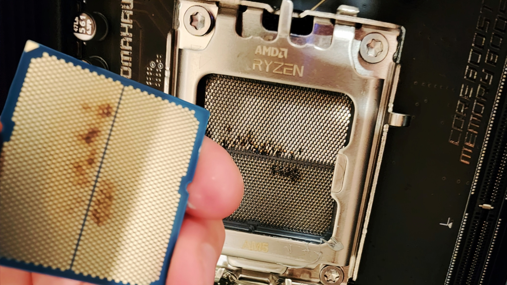

# AM5 CPU Failure Reports
{: .no_toc }



## Background
AM5 CPUs exploding are not a rare sight anymore unfortunately and has been around for quite a while by now. Reports of AM5 processors suffering severe failures began in the Ryzen 7000 era (aka since 2023), when AMD and motherboard vendors responded to burn-damage incidents by capping SoC voltage through AGESA and board BIOS updates at 1.3V. In other words, buggy firmware which resulted in CPU death by over-voltage.

<figure>
	
	<figcaption>An unlucky user with visible burn marks on both the CPU and socket (Credits: TechPowerUp)</figcaption>
</figure>

One would think this would have been solved by now, but apparently no. A later wave of CPU death emerged around the Ryzen 9000 release as well, especially around the 9800X3D. GamersNexus themselves have reported compiling a [March 2025 sample of 42 dead 9800X3D CPUs](https://gamersnexus.net/cpus-news/asrock-9800x3d-instability-and-failures-report-summary-so-far), of which 34 on ASRock boards, 6 on ASUS, one on Gigabyte and one on MSI. The affected boards spanned across numerous chipsets of which 30 were X870s, 6 were B850s, 4 B650s, and 2 X670s. 

{: .note }
> The fact that multiple chipsets were affected means this isn't a single chipset defect; this is a firmware issue potentially.

Initial symptoms were not dramatic nor immediate. According to numerous posts, forum threads and news articles, many of the systems apparently were running completely fine before failing suddenly, with the time period spanning anywhere from under an hour to potentially several months. Such failures often manifested themselves presenting a debug code (on motherboards that can present debug codes) that typically points to CPU initialization failure (otherwise solid CPU red for the debug LEDs present on most AM5 motherboards). Only a smaller subset of suh reports involved obvious burn marks or scorched contact areas.

This is interesting because it could mean at least two different classes of failure: systems that appear dead because they cannot boot (motherboard failure potentially as well), and systems that have incurred physical damage (burning via overvoltage or otherwise).

### What exactly is happening?
The exact root cause still has not been fully established nor pinned down, but there are two extremely strong theories as to why this is happening. The strongest possibility at the moment, supported primarily by GamersNexus is that it could be due to BIOS-related boot and stability issues, with a second possibility (weaker but still plausible) of a potentially bad CPU batch.

{: .info }
> Another key takeaway from the GamersNexus article was that some of the "dead" CPUs apparently **came back to life by flashing to an older BIOS**, or by using a special ASRock BIOS, which could point to the fact that at least part of the failure pool in fact was not because of permanent silicon death, but firmware-level instability, or even corrupted microcode which got cleared with the older AGESA update.

One possible mechanism of failure was that some 9800X3D samples were not receiving enough voltage to boot reliably under certain BIOS conditions, with some users on forums claiming that ASRock had provided a BIOS version that raised voltage to 1.2V to resolve a persistent "00" boot failure (CPU initialization failed). This 

## Credits
- [ASUS's](https://www.asus.com/ca-en/support/faq/1050307/) and [Gigabyte's](https://www.gigabyte.com/press/news/2086) initial statement for the 7000 series issues in 2023.
- [GamersNexus press release](https://gamersnexus.net/cpus-news/asrock-9800x3d-instability-and-failures-report-summary-so-far), [Tom's Hardware](https://www.tomshardware.com/pc-components/cpus/asrock-fixes-burned-out-am5-motherboard-by-cleaning-the-socket) and [TechPowerUp](https://www.techpowerup.com/332416/burning-saga-continues-this-time-its-an-amd-ryzen-7-9800x3d-cpu).
- A LOT of Reddit posts and other forum posts (Level1Techs, TechPowerUp forums, LTT forums, etc.)